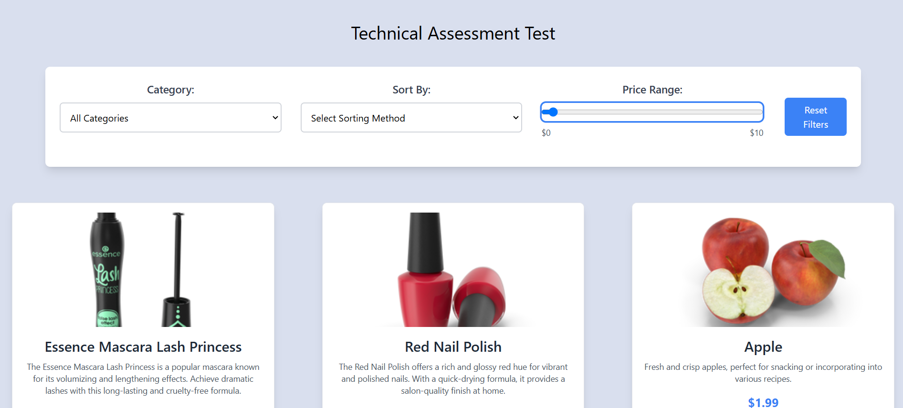

# Product Listing App with DummyJSON API

A simple web app built using Vite, React, and TailwindCSS to display products retrieved from the DummyJSON Products API. It features product details such as name, price, description, and thumbnail image, along with sorting and filtering functionality.

## Features

- **Product Details**: Displaying product name, price, description, and thumbnail image.
- **Sorting and Filtering**: Users can sort products by price or category.
- **Responsive Design**: The app is fully responsive, ensuring a seamless experience on both desktop and mobile devices.

## Screenshots

**Home Page**





_Description of the home page, showing product listings with sorting and filtering options._

---

## Technologies Used

- **Vite**: A fast, modern development build tool.
- **React**: JavaScript library for building user interfaces.
- **TypeScript**: A superset of JavaScript that adds static types, improving code quality and developer experience.
- **TailwindCSS**: A utility-first CSS framework for rapid UI development.

## Getting Started

Follow these steps to set up and run the project locally:

### Prerequisites

Ensure that you have the following software installed:

- [Node.js](https://nodejs.org/) (version 16.x or higher)
- [npm](https://www.npmjs.com/) or [yarn](https://yarnpkg.com/)

### Installation

1. Clone the repository:

   ```bash
   git clone 'https://github.com/Sheedii/Technical-Assessment-Test'
   cd test

2. Install dependencies:

   ```bash
    npm install

3. Run the development server:

   ```bash
    npm run dev


# Features

1. Product List

The app fetches data from the DummyJSON Products API and displays a list of products. Each product card includes:

Name: The name of the product.
Price: The price of the product.
Description: A brief description of the product.
Thumbnail: A small image preview of the product.

2. Sorting & Filtering

You can sort the product list by:

Price: Sort by ascending or descending order.
Category: Filter products by category.

3. Responsiveness

The design is fully responsive, adapting to both desktop and mobile screen sizes. The layout adjusts accordingly to provide an optimal viewing experience across different devices.

# Chadi Amara Nebli
# shediamara2019@gmail.com